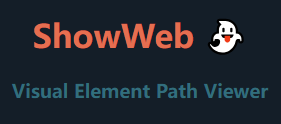
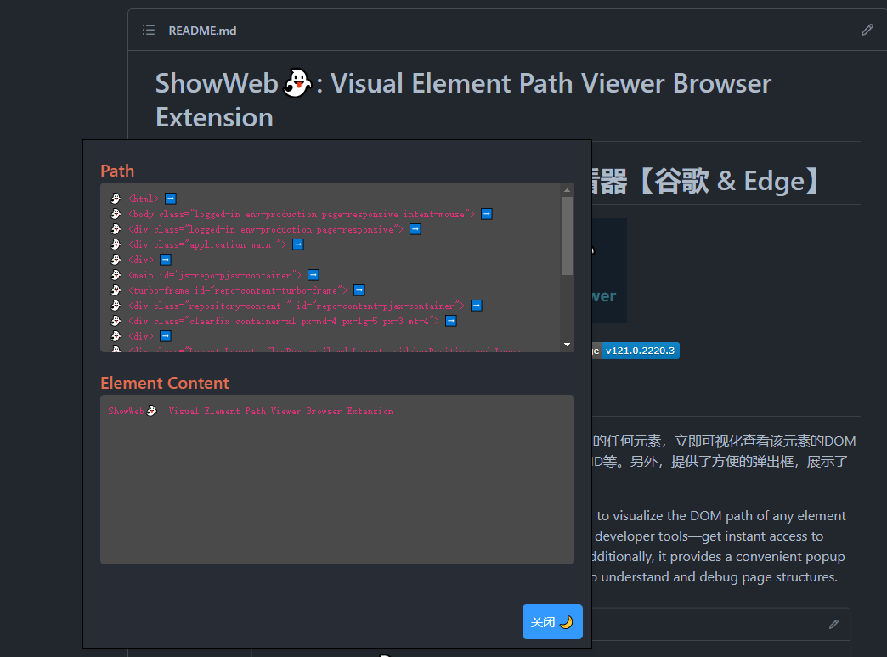

# ShowWeb👻: 可视化元素路径查看器

<p align="center"></p>
<p align="center">
    
    
</p>
<p align="center">
    Edge Add-ons：<a href="https://microsoftedge.microsoft.com/addons/detail/showweb%E5%8F%AF%E8%A7%86%E5%8C%96%E5%85%83%E7%B4%A0%E8%B7%AF%E5%BE%84%E6%9F%A5%E7%9C%8B%E5%99%A8/dnieapbhjmgkbgkadimhjmigcefjmilb">ShowWeb</a>
</p>

## 简介

轻松了解网页上的元素结构！按住配置的修饰键即可进入检测模式，鼠标悬停元素时显示绿色高亮框，点击后弹出 DOM 路径和内容。无需打开开发者工具，快速获取页面元素信息。



## 主要功能

- **可配置修饰键**：支持 Ctrl、Alt、Shift 自由组合，通过插件弹出面板设置并持久化保存
- **实时高亮框**：鼠标悬停元素时显示绿色边缘高亮框，精确指示目标元素
- **路径弹窗**：点击高亮元素后显示 DOM 路径和内容，支持拖拽移动
- **一键复制**：弹窗内置"复制路径"按钮，快速将路径复制到剪贴板
- **简洁实用**：释放修饰键即退出检测模式，不干扰正常浏览

## 使用方法

1. **配置修饰键**：点击浏览器工具栏的 ShowWeb 图标，勾选需要组合的修饰键（默认 Alt+Shift）
2. **进入检测模式**：在网页上按住所选的修饰键组合
3. **查看高亮**：鼠标悬停元素，绿色高亮框会实时跟随
4. **获取路径**：点击高亮的元素，弹窗显示 DOM 路径和内容
5. **复制路径**：点击弹窗中的"复制路径"按钮即可复制
6. **退出模式**：释放修饰键即可退出检测模式

## 安装

### 从 Edge 应用商店安装

[ShowWeb - Edge Add-ons](https://microsoftedge.microsoft.com/addons/detail/showweb%E5%8F%AF%E8%A7%86%E5%8C%96%E5%85%83%E7%B4%A0%E8%B7%AF%E5%BE%84%E6%9F%A5%E7%9C%8B%E5%99%A8/dnieapbhjmgkbgkadimhjmigcefjmilb)

### 手动加载（开发者模式）

1. 打开 `chrome://extensions/` 或 `edge://extensions/`
2. 开启右上角的"开发者模式"
3. 点击"加载已解压的扩展程序"
4. 选择本项目的根目录

## 目录结构

```
├── manifest.json      # 扩展配置 (MV3)
├── content.js         # 内容脚本 - 核心逻辑
├── content.css        # 内容脚本样式
├── background.js      # Service Worker
├── popup.html         # 插件弹出面板
├── popup.js           # 弹出面板逻辑
└── images/            # 扩展图标
```

## 技术栈

- Chrome/Edge Manifest V3
- 纯原生 JavaScript，无框架依赖
- `chrome.storage.local` 持久化配置

## To-Do

- [ ] 添加控制台界面
